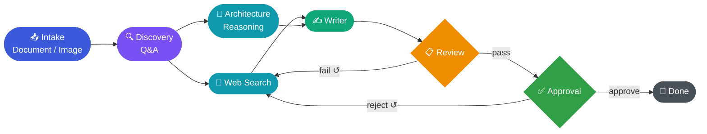

## Pipeline

intake → discovery → research → review → approval

## Agent Flow

## Stage: intake

execution: intake
llm_slot: intake
agents:
  document: intake-document
  image: intake-image
interrupt: confirm_understanding

## Stage: discovery

execution: structured_interrupt
llm_slot: discovery
agent: discovery
output_schema: DiscoveryOutput
interrupt: question

## Stage: research

execution: fanout_merge
llm_slot: researcher_search
fanout:
  - llm_slot: researcher_search
    agent: research-search
  - llm_slot: researcher_reasoning
    agent: research-reasoning
merge:
  llm_slot: researcher_writer
  agent: research-writer

## Stage: review

execution: structured
llm_slot: reviewer
agent: review
output_schema: ReviewResult
context: [document_draft, document_version, discovery_questions]
on_pass: approval
on_fail: research

## Stage: approval

execution: structured
llm_slot: approver
agent: approval
output_schema: ApprovalResult
context: [project_brief, document_draft, document_version, discovery_questions, review_result, revision_count]
on_approve: complete
on_reject: research
max_revisions: 5
